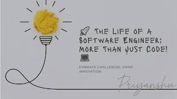

### Discovering What Software Engineering Really Means

Coming into this class, I didn’t fully understand what software engineering meant. I thought it was just another way of saying “coding,” especially since we were building web apps. But after working on the Study Palz project and learning about the tools and practices that real development teams use, I realized that software engineering is about much more than just writing code. It is about how you plan, organize, test, maintain, and collaborate on a project from start to finish.

### Learning to Work Smarter with Agile and Issue Driven Project Management

One of the most important things I learned was Agile Project Management, specifically a style called Issue Driven Project Management (IDPM). Agile is a flexible way to manage projects by breaking work into small, manageable tasks and completing them in short, focused cycles. In IDPM, every task is written up as an issue, usually with a clear description, someone assigned to it, and a status that tracks progress. We used GitHub Issues for this, and it helped our team stay organized, see who was working on what, and keep things moving even when we weren’t all coding at the same time. I can see myself using this same method for non-coding projects too, like planning an event or working on a group assignment.

### Staying Organized with Configuration Management

One thing I had never done before this class was use something like GitHub to manage a project. Configuration Management is about keeping track of changes in your code so that nothing gets lost or accidentally messed up, especially when working with a team. At first, using branches and merging felt a little confusing, but once I got the hang of it, it made things way easier. I also learned how important it is to manage environment variables. Besides editing the .env file in development, we had to set the same variables in Vercel so the app would work online. 

### The Importance of Clear Documentation and Open Source Practices

I also learned how valuable good documentation is, especially in open source development. This was my first time writing README.md and index.md files to explain what our project was about, how to run it, and how others could get involved. I have seen open source projects before but didn’t realize how much thought goes into making them understandable to other developers. Now I understand that clear documentation is just as important as clean code. If someone can’t figure out what your project does or how to use it, they probably will not use it, even if the code works perfectly.

### Conclusion

This class showed me that software engineering is more than just writing code. It is about how you manage your work, stay organized, and build something that can last and improve over time. I learned how to plan better, work with a team, and use tools that real developers use. Even if I am not building web apps, I can still use these skills in other areas, like group projects, future jobs, or personal projects I want to work on. These lessons will definitely stick with me going forward.
