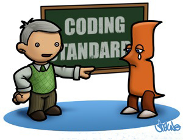

## The Importance of Coding Standards 

Coding standards are crucial for anyone learning a programming language. They not only help us avoid common mistakes but also encourage us to write cleaner and more organized code. By following clear guidelines, we can enhance the readability and structure of our code, making it easier for ourselves and others to understand and maintain. 

## How ESLint Helps Detect and Fix Code Issues

After using ESLint with VSCode for a week, I’ve found it to be incredibly helpful. For someone who isn’t very experienced with coding, it's easy to overlook small mistakes like missing semicolons, extra spaces, or inconsistent naming. ESLint acts as a real-time guide, pointing out these issues as you go, which makes it easier to learn what to avoid. Not only does it catch mistakes, but it also offers suggestions for fixing them, which is a great way to understand the correct approach.

## ESLint’s Automatic Fixing: A Time-Saving Feature

I also appreciate that ESLint can automatically fix some of the common mistakes. This feature saves me a lot of time, because I don’t have to search my code for little errors or try to remember every single rule. Instead, I can spend more time understanding how my code works 
