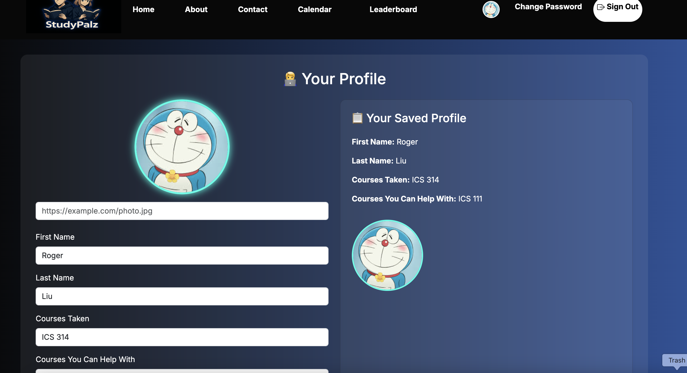
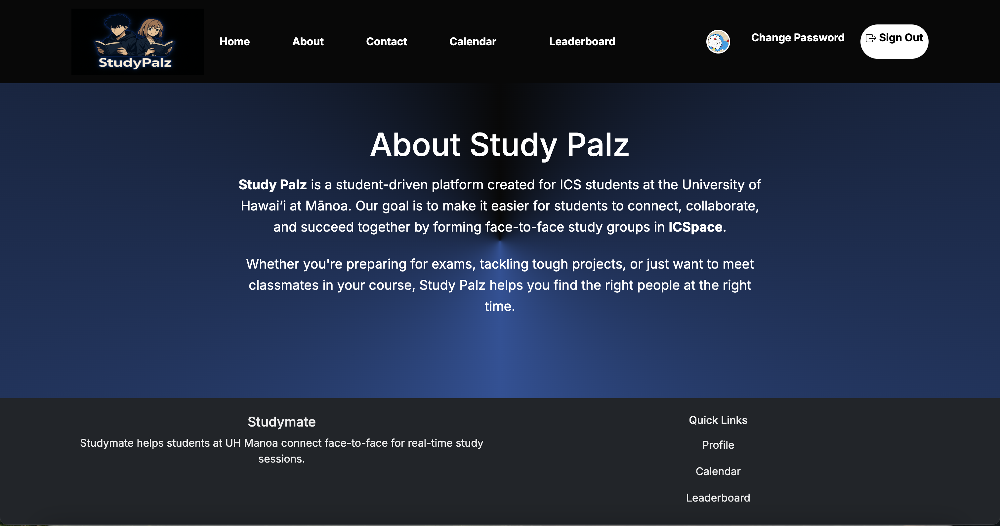
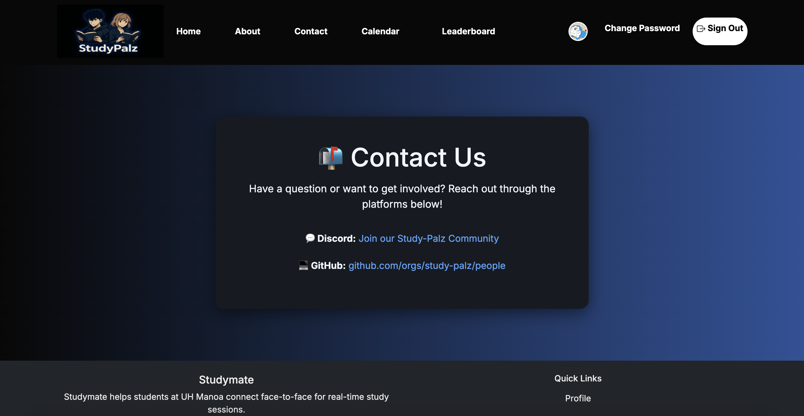
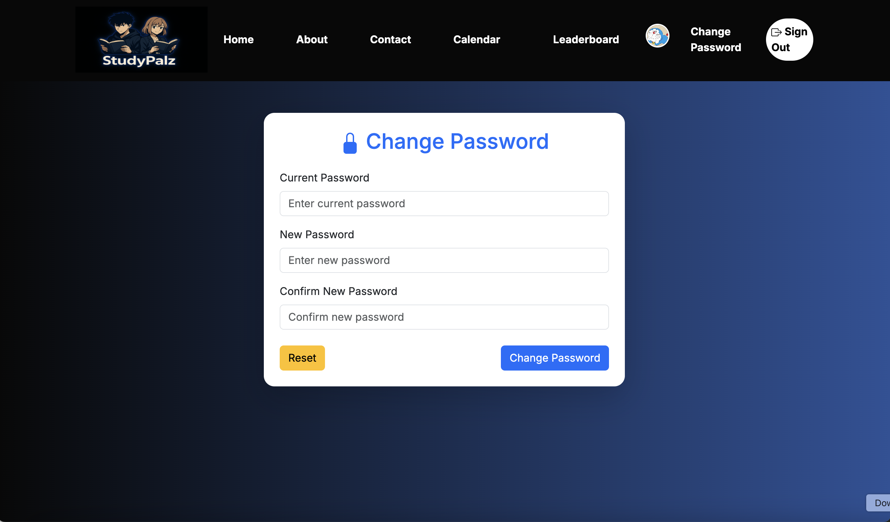

  
  
  
  
  

[Read the full project overview](https://study-palz.github.io/)

### My Contributions to Study Palz

For the **Study Palz** project, my team and I built a website designed to help ICS students at UH Mānoa organize and join in-person study groups. The goal was to create a platform where students can easily connect, find study partners, and collaborate in ICSpace. I worked extensively on various parts of the website, contributing to both the front-end and back-end. My main focus was on building specific pages, ensuring the site was user-friendly, and adding features to improve the overall experience.

### Key Areas I Worked On

#### Front-End Development

- **Home Page, Navbar, and Footer:** I was responsible for designing and building the entire layout of the home page, along with the navigation bar and footer. I made sure that everything was intuitive and easy to navigate.
  
- **Profile Page:** I created the profile page from scratch, allowing users to input their first and last name, add their classes, and upload a profile picture. I also made sure the profile image was displayed as an icon on the home page once uploaded, so users could easily recognize each other.

- **Sign-In, Sign-Up, and Change Password Pages:** I built the **Change Password** page myself and added bounce-in animations to the **Sign-In** and **Sign-Up** pages to make the user experience smoother and more engaging.

#### Collaboration on Other Pages

- **Leaderboard & Calendar Pages:** While I wasn't the main developer for these pages, I provided feedback and made sure they were consistent with the rest of the site. I also helped out wherever needed to ensure the pages fit within the overall design and function properly.

- **About and Contact Pages:** I developed these pages, making sure to explain what the site is about and how users can get in touch with us.

### Deployment and Design

- **Website Deployment:** I was involved in deploying the website to **Vercel** and made sure the environment variables were set up correctly for both development and production. This helped ensure the site ran smoothly during the development process and once deployed.

- **Logo Design:** I also designed the **Study Palz** logo, which gave the website its unique identity and branding.

### Documentation and Team Collaboration

- **Documentation:** I helped create and edit the `index.md` file that explains the purpose of the site and how users can interact with it. This made it easier for others to understand the website and its features.

- **GitHub Project Board:** I assisted in setting up a GitHub project board to track tasks, assign issues to team members, and help us stay organized throughout the project.

### What I Learned

The Study Palz project was an incredible learning experience. It gave me hands-on experience with **Next.js**, **Prisma**, **Vercel**, and **GitHub**. I learned how to build and deploy a full-stack web application and gained valuable insights into user interface design and development.

I also learned the importance of **teamwork** and **clear communication**. Using tools like GitHub Issues and the project board helped keep everything organized and ensured we were all on the same page. The project also taught me how essential it is to write clear and helpful documentation so others can understand the work we’ve done.

For those interested in exploring the source code or learning more about the project, you can visit the [Study Palz GitHub Organization Page](https://github.com/study-palz/study-palz.github.io).

